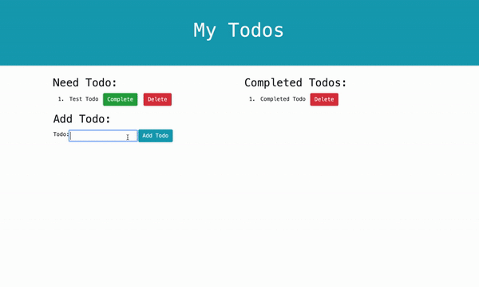

# Todo App 

## Project Preview



## Table of Contents 

* [Usage](#usage)
* [Future Development](#future_development)
* [Questions](#questions)

## Usage

This application is a simple to do app. Users will be able to add, complete, and delete to dos. 

This application is deployed on [Heroku](https://kelly-todo-app.herokuapp.com/)


### User Story
```
AS A user, I want to be able to write and save my tasks

I WANT to be able to delete tasks I've saved before

SO THAT I can organize my thoughts and keep track of tasks I need to complete 
```

## Future Development 
Currently, this app is not mobile ready and is best viewed on desktop.

## Questions? 
* Please email me if you have any questions at kelly.a.gowing@gmail.com
* OR visit my [GitHub](https://github.com/kelly70ve): 